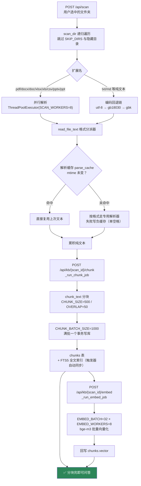
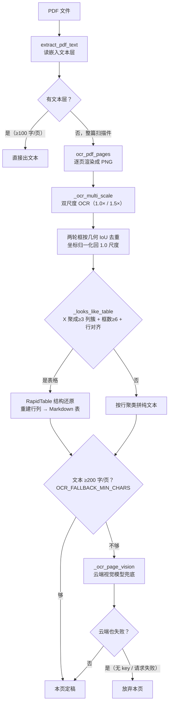

# 检索全链路说明

> **名词约定**：专业名词一律写成「中文（英文术语）」——先说人话，括号里给业界标准叫法。
>
> 本文按 **数据怎么进来 → 问题怎么走 → 每一步调谁** 的顺序编排，逐段对应源码。
>
> 配套文档：[检索流程图](./检索流程图.md)｜[优化全过程](./OPTIMIZATION.md)｜[返回 README](../README.md)
>
> 链路版本：**2026-09-26**。主路是服务端 Agent 执行器；2026-09-20 那版「两次检索 + RRF Top30」的前端链已归档成对照档（设置弹窗可切）。

---

## 目录

| 部分 | 内容 | 代码位置 |
|---|---|---|
| 第一部分 | 入库链路：文档 → 可检索的块 | `scan_dir` / `read_file_text` / `chunk_text` / `_run_embed_job` |
| 第二部分 | 一问到底：服务端 Agent 主链九步 | `POST /api/agent/chat` |
| 第三部分 | 混合检索引擎逐段拆解 | `api_search()` |
| 第四部分 | 查表专线（Text-to-SQL 四步） | `route_query` / `sql_route_search` |
| 第五部分 | MMR 多样性选块（默认关） | `mmr_diversify` |
| 第六部分 | 负题判定 | 拒答闸前的"能不能答"判断 |
| 第七部分 | RAG 生成：命中块 → 最终回答 | 提示词拼装 + 流式输出 |
| 第八部分 | 计算题专线 | `calc_tool` |
| 第九部分 | 3 次采样投票 | vote 分支 |
| 第十部分 | 防幻觉九层 | 贯穿提示词 / 生成 / 检索 |
| 第十一部分 | 韧性保护 | 超时 / 重试 / 断路器 / 令牌桶 |
| 第十二部分 | 入库即用（首库 0 等待） | `api_search` 降级分支 |
| 附录 A | 模型调用全景表 | — |
| 附录 B | 三个模型的分工 | — |
| 附录 C | 一次提问的调用量与费用 | — |
| 附录 D | SSE 服务端 Agent 执行器 | — |

---

## 核心概念速查表（先记住这几个词，后面全用到）

| 中文说法 | 业界术语 | 干什么的 |
|---|---|---|
| 聊天大模型 | LLM（Large Language Model） | 理解语言、生成文字 |
| 嵌入大模型 | Embedding 模型 | 把文字变成一串数字（向量） |
| 排序大模型 | Rerank 模型（重排模型） | 给候选内容逐个打相关度分 |
| 向量 | Vector | 一串数字，代表一句话的"语义坐标" |
| 分块 | Chunk（切片） | 长文档切成 500 字左右的小段 |
| 混合检索 | Hybrid Search | 语义搜索 + 关键词搜索两条路一起跑 |
| 倒数排名融合 | RRF（Reciprocal Rank Fusion） | 把两路搜索的排名合并成一份 |
| 全文检索 | FTS（Full-Text Search） | 数据库自带的文字搜索功能 |
| BM25 | BM25（打分算法） | 全文检索内置的相关性打分公式 |
| 查询意图 | Query Intent（结构化查询指令） | "去哪张表找什么值"的机器指令 |
| 召回 | Recall（召回率） | 该找到的内容有没有被找回来 |
| 检索增强生成 | RAG（Retrieval-Augmented Generation） | 先查资料再回答的完整架构 |
| 思考模式 | Thinking Mode（推理模式） | 部分模型先内部推理再回答的开关 |

---

## 第一部分 · 入库链路（文档 → 可检索的块）

一句话：**选文件夹 → 扫描 → 解析成纯文本 → 切成 500 字的块 → 向量化**。
扫描和分块是秒级，向量化是分钟级——所以才需要第十二部分的「入库即用」。

### 1.1 全景



相关端点：

| 端点 | 作用 |
|---|---|
| `POST /api/scan` | 扫描文件夹，登记文件清单 |
| `POST /api/kb/{scan_id}/chunk` | 启动分块（写入 chunks 表） |
| `GET /api/kb/{scan_id}/chunk/status` | 分块进度轮询 |
| `POST /api/kb/{scan_id}/embed` | 启动向量化 |
| `GET /api/kb/{scan_id}/embed/status` | 向量化进度轮询 |

### 1.2 扫描（`scan_dir`）

递归遍历用户选中的目录，跳过这些子树（`SKIP_DIRS`）：

```
$RECYCLE.BIN │ System Volume Information │ $WinREAgent │
node_modules │ .git │ dist │ build │ __pycache__ │ venv
```

跳过的都是"不可能有业务文档、但文件数可能上万"的目录——不跳的话，一次选到项目根目录就会扫出几万个 js 文件。

### 1.3 解析分派（`read_file_text`）

所有格式最终都归到"一段纯文本"，分派表如下：

| 扩展名 | 解析器 | 说明 |
|---|---|---|
| `.pdf` | `extract_pdf_text` | 文本层抽不出（<100 字/页）→ 转 OCR 链 |
| `.docx` | `extract_docx_text` | 段落 + 表格 + 5 类矢量文字载体（见 1.5） |
| `.doc` | `extract_doc_text` | 先转 `.docx`（或 macOS 直转 txt）再走同管线 |
| `.xlsx` | `extract_xlsx_text` | 每张 Sheet 转 Markdown 表格 |
| `.xls` | `extract_xls_text` | 老格式，依赖 COM / 转换兜底 |
| `.csv` | `extract_csv_text` | 直接读，转 Markdown 表格 |
| `.pptx` | `extract_pptx_text` | 形状文字 + SmartArt 递归抽取 |
| `.ppt` | `extract_ppt_text` | 老格式，同 `.xls` 的预转换路线 |
| 其他（`.txt`/`.md`） | 编码回退链 | `utf-8` → `gb18030` → `gbk`，三种全败才算失败 |

两个工程细节：

- **解析缓存**：成功和失败都写。失败标记存**单个空格**（`" "`）——`cache_get` 判 `None` 才算未命中，空串算命中跳过。这是**负缓存**：一个坏文件（扩展名是 `.xlsx` 实则是别的格式）不会每次重扫都重跑一遍慢路。
- **并行度 8**：`SCAN_WORKERS = 8`，磁盘 IO 型任务的实测甜点——线程再多，SSD 随机读反而排队打架。

### 1.4 PDF 双链路

PDF 有两条完全不同的路，代码按"这页有没有文本层"分流：



**为什么要双尺度 OCR**：RapidOCR 对原生分辨率下的瘦字符（比如表格里的「1」「7」）有识别盲区，放大到 1.5 倍重扫能把漏掉的补回来。两轮结果按几何 IoU（交并比）去重——同一位置同一文字只留一次，坐标统一归一化回 1.0 尺度，供后面的 RapidTable 和行聚类共用。

**为什么要表格判定**：OCR 出来的是一堆"字框"，表格页和纯文字页的框分布不一样——表格页的字框天然按列对齐（X 坐标聚成 ≥3 个簇），纯文字页的框 X 基本全对齐（1 个簇）。但单靠 X 聚类会被架构图/流程图骗过（它们的标签也分列），所以加了第二维约束：**真表格的行内框必须落在列位置上**（行 × 列网格对齐），而流程图标签是散乱的。

OCR 引擎本身在 2026-09-27 从 `rapidocr-onnxruntime` 迁到了 `rapidocr` 3.x——旧包上游停更、无新轮子，新包模型内置可离线跑。

### 1.5 图片 OCR 与表格还原

`.docx` / `.pptx` 里嵌的图片走同一条 OCR 链。这里有三个曾经的坑，均已修复：

**B1 · 串行版漏 `return`（已修）**

```
修前：process_image 算完 text 就结束 → 隐式返回 None
      → 调用方 if t: 判定恒为假 → 非表格页整页静默丢弃
      → 纯扫描 PDF（无嵌入图）的非表格页文本全部丢失
      （表格页因为提前 return 反而幸存——所以症状是"表格没事、正文没了"）

修后：process_image 降级成薄壳，直接转发到并行版
      return _process_ocr_boxes(png_bytes, _ocr_multi_scale(png_bytes), ...)
      → 串行 / 并行两版行为一致，防再分叉
```

**B5 · 云端视觉兜底被挡死（已修）**

```
修前：if not boxes 分支里才试 _ocr_page_vision，
      但上层逻辑让这个条件永远不成立 → 兜底形同虚设

修后：OCR 零结果时才试云端视觉（OCR 永远是主通道）；
      云端也失败（无 key / 请求失败返 None）才放弃本页
```

**B4 · `.docx` 漏读 5 类文字载体（已修）**

`python-docx` 的默认 API 只读顶层段落和表格。现在额外补抽 5 类矢量文字：

| # | 载体 | 抽取方式 |
|---|---|---|
| ① | 文本框 / 形状 | 遍历 `w:txbxContent` 下的 `w:t`（按内容去重——`mc:AlternateContent` 的 Choice/Fallback 各含一份相同的） |
| ② | SmartArt | 直读 `word/diagrams/data*.xml`，正则抽 `<a:t>` |
| ③ | 图表 | 抽 `c:pt` / `c:v` 数值 + `a:t` 文本 |
| ④ | OLE 嵌入的 Excel / Word | 落临时文件后**递归**走本函数 |
| ⑤ | 图片 Alt Text | 抽 `wp:docPr` 的 `descr`（无障碍描述常含语义关键词） |

这 5 类都是矢量文字，直读比 OCR 又快又准；剩下的位图内容仍走 OCR 链。每个补抽各自独立 `try`——zip 部件损坏（CRC 错 / 截断）时只丢这一小块，不能让异常冒到外层，否则会把已抽好的段落和表格整篇丢掉。

### 1.6 分块（`chunk_text`）

"往桶里装段落"算法，四步：

```
1. 按空行切段落（空行 = 天然语义边界）
2. 段落逐个装桶；桶满（~500 字）封桶成块，新桶带 50 字重叠
3. 表格段落整表成块（巨表按行组切，每组都带表头）
4. 超长段落先切句，单句还超就硬切，碎片也走装桶
```

两个常数：

| 常数 | 值 | 调的后果 |
|---|---|---|
| `CHUNK_SIZE` | 500 | 调大 = 块更粗更少（省向量费），调小 = 更碎更多（检索更细） |
| `CHUNK_OVERLAP` | 50 | 防止答案句子正好被切断丢上下文 |

第 3 步是表格库的关键：**整表成块**保证表头和行不会被切散——切散了的话，单独一个数据行脱离表头就完全失去语义。

### 1.7 向量化（`_run_embed_job`）

```
chunks 表里 vector IS NULL 的块 → 分批送给 bge-m3 → 回写 chunks.vector
```

| 参数 | 值 | 原因 |
|---|---|---|
| `EMBED_BATCH` | 32 | 服务商单请求限载，硬塞报 413 |
| `EMBED_WORKERS` | 8 | 压测 8 路 282 块/s 零 429；12 路直接贴限流墙 |
| 批次日志 | `trace_id` 穿透到工人线程 | 出问题时能按 trace 追到具体批次 |

向量化是后台任务，进度由 `GET /api/kb/{scan_id}/embed/status` 轮询。**它不阻塞问答**——见下一节。

### 1.8 入库即用（首库 0 等待）

**背景痛点**：首次入库全库向量化要 ~10 分钟，期间提问会被挡成普通聊天（"上线后这么慢会被骂"）。

**现在的流程**：分块完成（秒级）→ ✅ 立即可问答。提问时按向量状态自动选模式：

| 向量状态 | 模式 | 行为 |
|---|---|---|
| 全库无向量 | keyword-only | 关键词路先行 + 前端提示"向量生成中 N/总数——关键词模式" |
| 部分就绪 | hybrid | 语义路只用已有向量的块，关键词路全量 |
| 全部就绪 | 完整模式 | 语义 + 关键词 + RRF + 重排 |

向量后台补齐，**补到哪语义路自动生效到哪**，不需要重启。

四个实现要点：

- `api_search` 的"没向量就报错"改成降级（关键词先行）
- 首次提问自动触发后台向量化，但触发后不等——关键词模式先答
- **FTS 触发器**是"分块即用"的数据基础：每插一块自动进全文索引，分块完即有关键词索引
- 语义路的矩阵加载写的是 `WHERE vector IS NOT NULL`——天然跳过无向量块

---

## 第二部分 · 一问到底（服务端 Agent 主链）

> 2026-09-24 起生产主路切到**服务端 Agent 执行器**（SSE `/api/agent/chat`）：
> 预检索注入资料 + 模型自主挑工具循环取数，最多 5 轮。
> 2026-09-20 那版「前端两次检索 + RRF Top30 + 前端工具循环」保留为对照档（设置弹窗可切）。

### 2.1 单链编号版（一问到底的完整判定链，步骤连续 1-9）

> 2026-09-20 版描述的是旧前端引擎链（两次检索+RRF+前端工具循环）。
> 2026-09-24 起生产主路已切**服务端 Agent 执行器**（SSE `/api/agent/chat`）：
> 预检索注入 + 模型自主工具循环。旧链保留为对照档（设置弹窗可切）。
> 以下为当前生产链的完整判定链（步骤连续 1-9）。

```
(1) 会话路由（chat / auto 两分支）：
    ├─ 纯聊天（RAG 没开 或 知识库没向量化）→ chat 分支：
    │      预检索整段跳过、纯聊天提示词、不挂工具、单轮直答
    │      （MAX_ROUNDS=1，墙钟 2 分钟）→ 大模型回答 → 完
    └─ RAG 问答（RAG 开 + 库就绪）→ auto 分支 → (2)

(2) 检索前自动向量化（ensureEmbedded 等价下沉）：
    库里还有未向量化的块？→ 后台自动补嵌入（不阻塞本次问答）

(3) 短追问三阶判定？（问题 ≤30 字 且 对话已有 ≥2 轮）🤖LLM 分类
    ├─ 完整问题 → 检索词＝原题 → (4)
    ├─ FOLLOWUP（追问）→ LLM 补全检索词（"小李呢"→"李明做过哪些需求"）→ (4)
    └─ NEW（新话题）→ 检索词＝原题（上文不进检索，防跨话题污染）→ (4)

(4) 预检索（api_search 生产同款全链路）：
    ├─ Multi-Query 闸门：问题 >4 字？🤖LLM 改写 3 变体（术语/口语/英文）→ 4 个查询
    ├─ 语义路 🔵bge-m3（硅基）×N 查询，各取前 100 块
    ├─ 关键词路：BM25（FTS5 全文索引）×N 查询，各取前 100 块
    ├─ RRF 融合（0.6:0.4 权重）去重 → 候选池 100
    ├─ 重排 🟠bge-reranker-v2-m3：100 块逐对精算 → 前 K（格式感知：
    │      表格块为 0 时保底补位；MMR 默认关）
    │      重排挂 → 断路器降级为原始排序 + 前端提示
    ├─ 预检索块数按对话轮数动态下调：15→12→10→8（长对话不超上下文）
    ├─ D-5.3 第 2 路改写检索（每题无条件走）🤖：第 1 路 Top1 分 ≥0.4 →
    │      同义词改写（口语→专业词）；<0.4 → 反馈改写（喂命中块参考库内用词）
    │      → 变体走第 2 路 api_search → 两路按（文件+块号）去重留高分合并 Top15
    │      （改写失败 → 单路，不影响主路）
    └─ 产出：最终命中块 → 拼进 system 提示词 → (5)

(5) 系统提示词（ragSystem）注入：
    【资料N·相关性】出处+内容（最相关/相关/背景 分级标注）
    + 使用指引（预检索含答案→直接引用 [1][3]；多跳缺料→调工具补查；
      不相关→换文档原文表述重查；查表→sql_query；算数→calc）
    + 防幻觉第一层："资料里没有的明确说没有，不要编造"
    + 历史窗口：滑窗摘要（最近 12 条原文 + 更早压成 600 字摘要——20 轮不丢语境）

(6) 计算类问题？（数字预筛 + LLM 判定）🤖
    ├─ 是 → 3 次采样投票（温度 0/0.7/0.7，多数决；素材冻结——
    │      复用同一份检索结果不重查）→ 胜出答案直达输出 → 完
    └─ 否 → (7)

(7) 工具循环（MAX_ROUNDS=5 轮，墙钟 6 分钟）——五只读工具 🤖模型自主决策：
    ├─ search_kb：补检索（同款混合检索全链路）
    ├─ sql_query：精确值查表（SQL 直查 tables 元数据库）
    ├─ calc：代码确定性计算（"禁止自己心算"）
    ├─ list_kb_files：列库内文件清单
    └─ read_chunk：按文件+块号精读原文
    每轮：模型流式输出 → 发 tool_calls → 执行 → 结果分级截断
    （search 6000/sql 3000/calc 800 字）→ 回填 → 下一轮
    模型给出最终答案（无 tool_calls）→ (8)

(8) 防幻觉第二层（拒答闸）：
    检索与工具都没有依据 → "明确回答知识库资料里没有相关内容"
    （通用知识补充须标注"非知识库资料"）

(9) 降级兜底：
    ├─ 5 轮用尽仍无答案 → 基于已有资料降级作答（不空手）
    └─ 墙钟 6 分钟到 → 停止工具循环，基于已有资料作答
    → 大模型回答（deepseek-v4-flash，流式 SSE）→ 完
```

### 2.2 全景图（按路走：每条路一条线读完，不跳号）

整个系统一共 4 条可能的路径，你的问题走哪条取决于判定结果。
**每条路径内部步骤连续编号（①②③…），顺着读就是完整链路，不用跳。**
（当前主路 = 服务端 Agent 执行器 SSE；旧前端引擎保留为对照档）

━━━━━━━━━━━━━━━━━━━━━━━━━━━━━━━━━━━━━━
路径 A：普通聊天（RAG 没开 或 知识库没就绪）→ 最短路
━━━━━━━━━━━━━━━━━━━━━━━━━━━━━━━━━━━━━━
```
你敲回车
→ ① 服务端路由判 chat 分支：RAG 开关没开（或库没向量化）
→ ② 不检索、不挂工具，纯聊天提示词直接发大模型（墙钟 2 分钟）
→ ③ 大模型凭自己的知识回答（无资料锚定）→ 完
```

━━━━━━━━━━━━━━━━━━━━━━━━━━━━━━━━━━━━━━
路径 B：Agentic 问答主路（绝大多数 RAG 问题走这条）→ 预检索 + 工具循环
━━━━━━━━━━━━━━━━━━━━━━━━━━━━━━━━━━━━━━
```
你敲回车
→ ① 服务端路由判 auto 分支：RAG 开 + 库已向量化 ✓
→ ② 检索前自动向量化：库里未向量化的块后台补嵌入（不阻塞）
→ ③ 短追问三阶判定 🤖LLM（≤30 字且 ≥2 轮历史）：
      · FOLLOWUP → 补全检索词（"小李呢"→"李明做过哪些需求"）
      · NEW / 完整问题 → 用原题
→ ④ 预检索（api_search 生产同款）：
      · Multi-Query 🤖（>4 字改 3 变体 → 4 查询）
      · 语义路 🔵bge-m3 + 关键词路 BM25 各前 100 → RRF（0.6:0.4）→ 池 100
      · 重排 🟠bge-reranker（格式感知；挂了断路器降级为原始排序+提示）
      · 块数按轮数动态：15→12→10→8
      · D-5.3 第 2 路改写检索（每题无条件）：Top1 分 ≥0.4 → 同义词改写（口语→
        专业词）；<0.4 → 反馈改写（喂命中块学库内用词）→ 变体再走一路 api_search
        → 两路按（文件+块号）去重留高分合并（改写失败 → 单路）
→ ⑤ 拼系统提示词：【资料N·相关性分级】+ 使用指引 + 防幻觉第一层
      （"资料里没有的明确说没有"）+ 滑窗摘要历史（12 原文+600 字摘要）
→ ⑥ 计算题判定 🤖（数字预筛+LLM）：
      · 是 → 3 次采样投票（0/0.7/0.7 多数决，素材冻结不重查）→ 胜出答案 → 完
      · 否 → ⑦
→ ⑦ 工具循环（≤5 轮，墙钟 6 分钟）🤖模型自主调五只读工具：
      search_kb（补检索）/ sql_query（精确查表）/ calc（代码计算）/
      list_kb_files（列文件）/ read_chunk（精读原文）
      每轮工具结果分级截断（6000/3000/800 字）回填 → 模型觉得够了 → ⑧
→ ⑧ 防幻觉第二层（拒答闸）：没依据 → "资料里没有相关内容"明确说
→ ⑨ 产出最终答案（流式 SSE）；5 轮/墙钟尽 → 基于已有资料降级作答 → 完
```

━━━━━━━━━━━━━━━━━━━━━━━━━━━━━━━━━━━━━━
路径 C：计算题投票路（"单价35×3"这类）→ 检索照样走，答案靠投票
━━━━━━━━━━━━━━━━━━━━━━━━━━━━━━━━━━━━━━
```
你敲回车
→ ①~⑤ 同路径 B（预检索照走——题干数字/实体也要资料佐证）
→ ⑥ 计算判定 🤖：数字预筛中 + LLM 判 YES
→ ⑦ 3 次采样投票：温度 0/0.7/0.7，复用同一份检索结果（素材冻结），
      抽答案值多数决（≥2 票相同胜出）
→ ⑧ 胜出答案直达流式输出（不进工具循环）→ 完
```

━━━━━━━━━━━━━━━━━━━━━━━━━━━━━━━━━━━━━━
路径 D：拒答路（库里真没有）→ 诚实优先于硬答
━━━━━━━━━━━━━━━━━━━━━━━━━━━━━━━━━━━━━━
```
你敲回车
→ ①~⑦ 同路径 B（预检索 + 工具循环全走完，模型可自主换词补查 ≤5 轮）
→ ⑧ 全部没依据 → 拒答闸："知识库资料里没有相关内容"
      （模型自己的通用知识补充必须标注"（非知识库资料）"）
→ 完
```

━━━━━━━━━━━━━━━━━━━━━━━━━━━━━━━━━━━━━━
怎么知道我的问题走了哪条路？
━━━━━━━━━━━━━━━━━━━━━━━━━━━━━━━━━━━━━━
```
· RAG 开关没开 ──────────────→ 路径 A
· "单价35×3"这类算术题 ────────→ 路径 C（投票）
· 普通知识库问题 ────────────→ 路径 B（最常走；工具用没用看模型判断）
· 库里没有 且 补查也没捞到 ─────→ 路径 D（拒答）
```

**块数速记卡**（路径 B 的数字变化，全程可追）：

```
4 查询 × 2 通道 × 各 100 块 ＝ 最多 800 条记录
   → RRF 去重 → 200-400 个不重复块
   → 融合排序取 100 ＝ 候选池
   → 100 块全部进重排 → 按轮数动态取 15/12/10/8 拼进系统提示词
   → 模型觉得不够 → search_kb 补查（≤5 轮，每轮同款全链路）
   → deepseek-v4-flash 给答案（流式 SSE）
```

### 2.3 关键参数（现役）

| 参数 | 值 | 说明 |
|---|---|---|
| RERANK_POOL | 100 | 重排候选池宽（60→100：61-100 名可救；业界 Vertex/Azure 100 档） |
| TOP_K | 15 | 最终注入块数 |
| 预检索动态块数 | 15→12→10→8 | 按对话轮数下调（长对话不超上下文） |
| RRF 权重 | 0.60 : 0.40 | [语义, 关键词]（三轮扫参定案） |
| RRF_K | 60 | 融合常数（Elasticsearch 同款） |
| MMR | 默认关 | 全量实测净 -0.1pp≈0（功能保留） |
| 工具循环 | MAX_ROUNDS=5 | 墙钟 6 分钟（_Q_WALL=360；纯聊天 120） |
| 投票 | 3 采样 0/0.7/0.7 | 计算类多数决（素材冻结不重查） |
| 历史窗口 | 12 原文 + 600 字摘要 | 滑窗摘要（20 轮不丢语境） |
| 工具结果截断 | 6000/3000/800/2000/4000 | search_kb / sql_query / calc / list_kb_files / read_chunk 分级上限 |
| 改写检索阈值 | Top1 ≥0.4 | 同义词改写；<0.4 反馈改写（喂命中块） |

### 2.4 为什么这么设计

- **宽进严出**：召回层（8 路 RRF（倒数排名融合）前 100）宁滥勿缺，垃圾候选重排时沉底；漏掉的真相救不回来
- **Multi-Query（多查询）平权**：口语题靠变体翻译成术语捞块（D553"手头的钱"→变体"现金/Cash"）——加权版把变体话语权压到 1/6，这类题会挂（实测池第 11 名被打到 100 外）
- **SQL（数据库查询语言）路由只认精确值题**：本语料标识符不唯一，直查捞回的是"提到过"不是"答案在"（全量实测 -3.2pp 后收窄到仅精确值题走 SQL）
- **防幻觉两层**：命中时锚定资料来源；零命中时拒答闸——不给模型"凭记忆自由发挥"的路径
- **降级不断答**：rerank（重排）挂了退 RRF（倒数排名融合）原始排序；改写挂了退原题——增强是增益不是依赖

### 2.5 评测口径速查（与生产同款）

```
检索口 PASS（判过） = 文件关 AND（并且）关键词关
  文件关（宽口径）：期望文件在重排后前 15 名，或重排前 100 候选池内（第 16-100 名也算召回）
  关键词关（严口径）：答案关键词必须在前 15 名拼接文本里（+同义模糊/数字归一处理）
端到端 PASS（判过） = E2E（端到端）判分（LLM（大语言模型）回答含期望答案）
```

## 第三部分 · Hybrid Search（混合检索路，语义搜索主线）

### 3.1 前置：Multi-Query（多查询改写）

```
干什么：一个问题改写成多个角度的问法，多路捞块——
        口语题（"手头的钱"）靠变体翻译成术语（"现金/Cash"）才检索得到

谁来做：LLM（云端 API deepseek-v4-flash）🤖

怎么改：原题 + 3 个变体（专业术语版 / 口语版 / 英文版）

闸门（不白花钱）：
  · 问题 ≤4 字（如"你好"）→ 跳过改写，只用原题
  · 改写失败 → 退回只用原题（增强是增益不是依赖）

效果：4 个查询 × 2 通道 = 8 路召回，全进 RRF 融合（均权）
     （评测：D 桶 160 道真挂题净救 11 道；全卷 +0.6pp 噪声带内——
      但口语题段 +5pp 结构性占优，故进生产）
```

### 3.2 混合检索五段（语义 → 关键词 → RRF → 重排 → 改写）

#### 第 ① 段：Dense Retrieval（语义路，稠密检索）

```
┌────────────────────────────────────────────┐
│ 调用谁：🔵 嵌入向量模型（bge-m3，硅基流动，免费）——把问题和文档都转成向量
        模型细节：Embedding 模型（嵌入大模型 bge-m3，     │
│        硅基流动，免费）                        │
│                                            │
│ 发什么：问题原文                              │
│   "科目 1002 的期末余额是多少"                 │
│                                            │
│ 返回什么：Vector（向量，1024 个小数的数组）      │
│   [0.023, -0.081, 0.005, …, 0.044]         │
│   这串数字 = 这句话在"语义空间"里的坐标          │
│   （意思相近的话，坐标就挨得近）                 │
│                                            │
│ ★ 注意：嵌入模型只负责"文字→坐标"这一个动作。    │
│   它不算距离、不比较、不排序！                   │
└────────────────────────────────────────────┘
        │
        ▼
本地算Cosine Similarity（余弦相似度，零 API，CPU 算，0.02 秒）：

  干什么：拿问题的向量，和库里 17693 个Chunk（文本块）
         的预存向量（扫描入库时嵌入模型预先算好
         存在数据库里的）逐一算相似度

  怎么算：矩阵乘法（NumPy，纯数学，免费）

  结果：相似度最高的 100 块 = 语义路候选名单（每查询）
```

#### 第 ② 段：Sparse Retrieval（关键词路，稀疏检索，零 API）

```
干什么：问题里的词，字面出现在哪些块里（精确文本匹配）

怎么做（三条本地数据库查询同时进行）：
  a. FTS（Full-Text Search，全文检索）：
     BM25 打分——罕见的词值钱（IDF，逆文档频率）：
     "库存现金"只出现在 20 个块 → 值钱
     "多少"出现在 5000 个块 → 不值钱
  b. LIKE（模糊匹配）：
     全文索引查不到 2 字短词时的兜底
  c. Filename Anchor（文件名锚点）：
     "库存现金"出现在某个文件名里且只有 1 个文件
     叫这名 → 这个文件的块强加分（稀有度门槛过滤）

  预处理：问题分词后 [库存现金, 余额]——
  "的/多少/是"这些虚词被Stop Words（停用词表）滤掉，
  它们没有区分度（到处都是）

结果：每条查询取前 100 块 = 关键词路候选名单
```

#### 第 ③ 段：RRF（Reciprocal Rank Fusion，倒数排名融合）

```
干什么：把语义路和关键词路两个候选名单合并成一个

为什么不能直接比分数：语义路是 0~1 的余弦相似度，
关键词路是 BM25 分（量纲不同）——RRF 只用"排名"，
不管分数本身的量纲，天然公平。

怎么算（RRF 公式）：
  每块的总分 = Σ 每路权重 ÷ (60 + 这块在该路的名次)

  权重（2026-09-20 现役）：
  · Multi-Query（多查询）开时：8 路均权（每路 0.5/8）——
    4 个查询 × 2 通道 = 8 路，平权融合（评测实测平权比加权稳，
    口语题靠变体救——D553"手头的钱"靠变体"现金/Cash"才捞到）
  · 单查询模式：语义路 0.60 / 关键词路 0.40（三轮扫参定案：
    0.6:0.4 两批最优——原 0.45:0.55 方向拍反已纠正）

  例：A 块在语义路第 1、关键词路第 2
      总分 = 0.60/61 + 0.40/62 = 0.0162（高分）
      B 块只有语义路认（第 5），关键词路没进
      总分 = 0.60/65 + 0 = 0.0092（低分）

  两路都排前面的块 → 断层领先（互相印证的才是真好）

结果：按总分取前 100 块进入 Candidate Pool（候选池，RERANK_POOL——五轮步3 从 60 扩到 100，业界一般水平）
```

#### 第 ④ 段：Rerank（重排，交叉编码器精排）——🟠 调 bge-reranker-v2-m3（硅基）

```
┌────────────────────────────────────────────┐
│ 调用谁：Rerank 模型（排序大模型                │
│        bge-reranker，硅基流动，免费）           │
│                                            │
│ 发什么（一个请求打包 100 块）：                   │
│   {                                        │
│     "query": "科目 1002 的期末余额是多少",     │
│     "documents": [第1块文本, 第2块文本, …      │
│                   共 100 块]                  │
│   }                                        │
│                                            │
│ 返回什么：100 个 0~1 的相关度分数               │
│   第 3 块: 0.89（很相关）                    │
│   第 17 块: 0.75                            │
│   第 9 块: 0.12（不相关）                    │
│                                            │
│ 和 Embedding 的区别（为什么两道都要）：          │
│   Embedding = 双塔模式：问题和块【各自独立】     │
│              打坐标，快但粗                    │
│   Rerank = Cross-Encoder（交叉编码器）：        │
│           问题和块【放在一起细看】，慢但准        │
│   先粗筛（Embedding 从全库挑 100）            │
│   再精排（Rerank 从 100 挑 15）——业界标准两段式  │
└────────────────────────────────────────────┘

结果：按分数重排 → 取前 15 块 = 最终Top-K（最终答案块，K=15）
```

#### 第 ⑤ 段（每题无条件）：Query Rewriting（查询改写，换种问法再查一遍）

```
触发时机：第 1 路检索出结果后【无条件】尝试一次——不是"分数低才触发"

按第 1 路的 Top1 分数分两种写法：
  Top1 ≥ 0.4 → 同义词改写（synonym）
               凭空换专业词："购买模块" → "采购模块"
  Top1 < 0.4 → 反馈改写（feedback）
               把第 1 路命中的前 5 块（文件名 + 内容开头）喂给 LLM，
               让它照着库里真实用词重新表述

┌────────────────────────────────────────────┐
│ 调用谁：LLM（聊天大模型）                       │
│                                            │
│ 同义词改写的指令：                             │
│   "把问题改写成知识库检索用的最佳查询：            │
│    1) 口语词换专业词（购买→采购）；               │
│    2) 补上语料可能用的术语、实体名、领域词          │
│      （如工作包编号、表名、字段名）                │
│    只输出改写后的查询，不要解释。"                │
│                                            │
│ 反馈改写的指令（额外附上命中块作参考）：           │
│   "知识库检索命中不佳，需要改写查询重新检索。        │
│    以下是知识库里实际存在的文档——请参考这些         │
│    文档的用词，把用户的问题重新表述成最匹配         │
│    这些文档的检索查询。只输出改写后的查询。          │
│                                            │
│    参考文档：                                 │
│    文件名: AccountStatement.xlsx｜开头:         │
│      BALANCE B/FWD…                         │
│    文件名: 科目余额表.xlsx｜开头: 科目编码…      │
│                                            │
│    用户问题: 银行流水最后的余额是多少"            │
│                                            │
│ 返回什么（改写后的问题）：                       │
│   "AccountStatement 对账单 Ledger Balance     │
│    期末余额"                                 │
│                                            │
│ 为什么有效（解决词汇鸿沟 Vocabulary Gap）：       │
│   用户说"流水"（口语），库里叫"对账单"（术语）     │
│   ——LLM 看了库里的真实用词就能把两套语言接上。    │
│   换知识库自动适配，不需要维护任何同义词词典       │
└────────────────────────────────────────────┘

下一步：改写出变体（且与原查询不同）才跑第 2 路检索
       → 同一块（file + seq）留分数高者 → 合并排序取前 15

容错：这一路整体包在 try 里，挂了不影响主路——原词结果原样保留；
      改写结果和原查询一样（没改动）也跳过第 2 路。
      Top1 阈值 0.4 只决定"用哪种写法"，不决定"跑不跑"。
```

---

### 3.3 前端两道"换词"工序（与 Query Rewriting 的关系）

补全和同义词改写是两道独立的"换词"工序：

- **补全**（短话变完整话）：只在问题 ≤30 字且有对话历史时触发，发生在第一次查询之前
- **同义词改写**（口语换文档腔）：每次 RAG 检索都尝试，发生在两次查询之间；
  改写没变化或失败就跳过第二次查询，原词结果原样保留

## 第四部分 · 查表专线（Text-to-SQL）

### 4.0 这条线什么时候会被接上

`api_search()` 里，**只有聊天 key 非空时**才做路由判定：

```python
route = _route_query_safe(
    route_query(q, scan_id=scan_id, vec_key=chat_key, vec_url=chat_url)
    if chat_key else "search")

if route == "sql":
    sql_hits = sql_route_search(scan_id, q, vec_key=chat_key, vec_url=chat_url)
```

三点说明：

- **条件启用**：BYOK 模式下聊天 key 随请求传到服务端，才判路由；没填 key 直接走混合检索。
- **命名陷阱**：`sql_route_search` 的形参叫 `vec_key`，但实际收的是**聊天模型**配置——历史遗留名，源码注释里已标明。
- **两个调用方**：`GET /api/kb/{scan_id}/search`（旧端点）和 Agent 工具 `search_kb`，都走同一个 `api_search`。

判定逻辑本身见 4.1；判定结果若为 `sql`，再执行 4.2 的四步查询。

### 4.1 Query Routing（查询路由，判断这题走哪条路）

```
用户提问："科目 1002 的期末余额是多少"
        │
        ▼
┌─────────────────────────────────────────┐
│ Query Router（查询路由器）                │
│                                         │
│ 干什么：先本地判断（零成本，微秒级）         │
│ 怎么判：Regex（正则表达式）查问题里          │
│        有没有 3 位以上的数字或编号          │
│                                         │
│ 本题命中 "1002" → 判定走【结构化查询路】    │
└─────────────────────────────────────────┘
        │
        ├── 命中数字/编号 → 结构化查询路（往下看第二部分）
        │
        ├── 没命中 → 调 LLM（聊天大模型）判题型
        │    ┌────────────────────────────────────┐
        │    │ 调用谁：LLM（聊天大模型），1.6 秒       │
        │    │                                    │
        │    │ 发什么（Prompt，提示词）：              │
        │    │  "这个问题是【查表取数】还是            │
        │    │   【语义搜索】？只答 A 或 B            │
        │    │   提问：库存现金的助记码是啥"           │
        │    │                                    │
        │    │ 返回什么：一个字母                    │
        │    │  "A" = 查表题 → 走结构化查询路        │
        │    │  "B" = 语义题 → 走混合检索路          │
        │    └────────────────────────────────────┘
        │
        └── 知识库里没有表格（纯文档语料）
             → 不用判断，直接走混合检索路
```

---

### 4.2 Text-to-SQL 四步（结构化查询路，精确值专线）

> 业界叫法：把"自然语言问题"转成"结构化查询"再执行——类似 Text-to-SQL，
> 但我们不生成 SQL 语句，生成更安全的 JSON 的 Query Intent（查询意图）。

#### 第 1 步：Table Pruning（候选表粗筛，不调模型，毫秒级）

```
干什么：从 6152 张表里挑出最可能有答案的 3 张（缩小范围的预过滤）

怎么做：
  ① Tokenization（分词）：问题切成词 {科目, 1002, 期末, 余额}
  ② 每张表拼一个大字符串 = 文件名 + 表名（Sheet 名）
     + 所有列名 + 前 5 行数据
  ③ 逐张算Overlap Score（重叠分，词面撞分）：
     - 问题里的词出现在表的大字符串里 → 每个词 +1 分
     - "1002" 是 3 位数字且出现在表数据里 → 额外 +3 分
       （数字信号加权：含这个编号的表几乎一定是答案表）
  ④ 按分数从高到低排 → 取前 3 张（Top-3）

结果：3 张表的"名片"（Schema Card，表结构卡片）
```

#### 第 2 步：调 LLM 做 Query Intent Generation（查询意图生成）

```
┌────────────────────────────────────────────┐
│ 调用谁：LLM（聊天大模型），已关闭思考模式，      │
│        1.6 秒回答                             │
│                                            │
│ 发什么（3 张表名片 + 指令，约 1000 字）：        │
│                                            │
│   "你是数据查询助手。输出一个 JSON 查询意图。    │
│                                            │
│    用户问题: 科目 1002 的期末余额是多少        │
│                                            │
│    表1: 文件=科目余额表A  列名=[科目编码,      │
│         科目名称, 期末余额-借方, 期末余额-贷方]  │
│         样例=[1001, 库存现金, 546960.24, …]    │
│    表2: 文件=科目余额表B  列名=[同上]          │
│         样例=[1001, 库存现金, 546949.12, …]    │
│    表3: 文件=科目-资产表  列名=[科目, 助记码…]   │
│         样例=[1001, 库存现金, kcxj]"          │
│                                            │
│ 返回什么（JSON 格式的查询意图，机器能执行的指令）： │
│                                            │
│   {                                        │
│     "table": 2,             ← 去第 2 张表    │
│     "filters": [{                          │
│       "col": "科目编码",     ← 找这一列       │
│       "val": "1002",        ← 等于这个值     │
│       "exact": true         ← 精确匹配       │
│     }],                                    │
│     "target_col": "期末余额-借方" ← 取这列的值  │
│   }                                        │
│                                            │
│ 为什么生成 JSON 不生成 SQL：                  │
│   SQL 有注入风险（模型可能生成删表语句）；       │
│   JSON 意图只能表达"过滤+取值"，本地解释器       │
│   没有删改库的能力——安全边界是设计出来的         │
└────────────────────────────────────────────┘
```

#### 第 3 步：本地执行过滤（零 API，毫秒级）

```
干什么：拿着查询意图，对目标表Row Filtering（逐行过滤）

怎么做：
  表 2 每行数据是一个字典（Dictionary）：
    行1 = {科目编码: "1001", 科目名称: "库存现金", 期末余额-借方: "546960.24", …}
    行2 = {科目编码: "1001001", …}
    行3 = {科目编码: "1002", 科目名称: "银行存款", 期末余额-借方: "546949.1166", …}

  逐行检查：这行的"科目编码" == "1002" 吗？
    行1 不等 ✗
    行2 不等 ✗
    行3 相等 ✓ ← 命中！

  取行 3 的"期末余额-借方"的值

没命中时三层Fallback（容错，兜底补救）：
  容错1：列名模糊对齐（LLM 写"科目代码"→ 自动对齐到真列名"科目编码"）
  容错2：兄弟列轮试（"期末余额-借方"空 → 自动试"期末余额-贷方"）
  容错3：行值回退（"1002"出现在任意一列就算命中）
```

#### 第 4 步：返回精确值

```
结果：{"期末余额-借方": "546949.1166"}

★ Fallback（兜底机制）：第 1/2/3 步任何一步失败
  → 整题自动落回混合检索路重新走一遍（增强路不是主链路，输了不伤根基）
```

---

## 第五部分 · MMR 多样性选块（默认关）

### 5.1 MMR（最大边际相关性）——重排后置，默认关

```
干什么：重排出的前 30 名候选，不直接取分数前 15——改用
        「分数高 × 与已选块相似度低」贪心选 15 块

治什么：同文件挤占型挂题——考勤表/银行对账单这类多行相似块文件，
        每个块内容几乎一样（员工A迟到2次/员工B迟到1次…），
        纯分数取前 15 会被同文件"双胞胎块"灌满，真答案块被挤出去

怎么选（MMR 公式）：
  每轮从候选里选：λ×相关性分数 + (1-λ)×(1-与已选块最大相似度) 最高的那块
  λ=0.7：分数为主、轻度去重（多跳题答案在同表相邻块的场景不会被过度压掉）

调谁：谁都不调——纯本地数学（块向量已存库，点积算相似度，毫秒级，¥0）
开关：MMR_ON（True=开。评测对照不涨可随时撤；λ 可调）
```

## 第六部分 · Negative Detection（负题判定，"库里没有"型问题）

```
┌────────────────────────────────────────────┐
│ 调用谁：LLM（聊天大模型）                       │
│                                            │
│ 什么时候用：问"XX 的负责人是谁"但库里根本          │
│ 没有人员名单——检索分数判断不了"答案存不存在"       │
│ （库里有相关文档，分数就高——分数衡量的是           │
│  "相关性"不是"有没有答案"）                       │
│                                            │
│ 发什么：                                     │
│   "你是知识库审计员。以下文档能否直接回答          │
│    用户问题？只答 YES 或 NO。                   │
│    问题: QuickBiz 的测试负责人是谁              │
│    参考文档:【文档1】Quickbiz架构.docx:          │
│      …（讲架构，没人员名单）"                   │
│                                            │
│ 返回什么："NO"                               │
│                                            │
│ 下一步：NO = 库里真没有 → 前端回答               │
│        "资料里没有"，不瞎编（反幻觉）             │
└────────────────────────────────────────────┘
```

---

## 第七部分 · RAG 生成（命中块 → 最终回答）

**（很多人以为 15 块直接返回给用户界面——不是！15 块是"原料"，LLM 是"厨师"）**

```
检索/改写两轮合并出最终 15 块
        │
        ▼
┌─────────────────────────────────────────────┐
│ 前端把这 15 块拼成"参考资料"文本（上下文注入，    │
│ Context Injection）：                          │
│                                             │
│   "以下是从项目知识库检索到的参考资料：           │
│                                             │
│    【资料1】出处: 科目余额表.xlsx 第3块          │
│    | 科目编码 | 科目名称 | 期末余额-借方 |…     │
│    | 1002 | 银行存款 | 546949.1166 |…         │
│                                             │
│    【资料2】出处: xxx.md 第0块                   │
│    （第2块内容…）                              │
│    …（共15块，每块带编号+出处文件名+第几块）       │
│                                             │
│    回答要求：优先依据参考资料回答并注明出处        │
│    （如：据资料2）；资料里没有的明确说             │
│    '资料里没有'，不要编造。"                    │
└─────────────────────────────────────────────┘
        │
        ▼ 拼进Prompt（提示词）
┌─────────────────────────────────────────────┐
│ 调用谁：LLM（聊天大模型）——这就是 RAG 的 R       │
│        之后 G（Generation，生成）环节            │
│                                             │
│ 发什么：                                      │
│   System Prompt（系统提示）= 参考资料 + 回答要求  │
│   用户消息 = 用户原问题                         │
│   + 聊天历史（多轮对话时带上前几轮）               │
│                                             │
│ 模型干什么：像人开卷考试一样"读着资料答题"          │
│                                             │
│ 返回什么：一段自然的回答文字（流式输出，            │
│   Streaming，一个字一个字打出来）                 │
│   "科目 1002（银行存款）的期末余额为              │
│    546949.1166 元（据资料1）。"                │
└─────────────────────────────────────────────┘
        │
        ▼
用户在界面看到回答（带出处引用）
前端进程面板能看到"RAG 命中 15 块（已注入提示词）"
```

**负题判定（YES/NO 那步）发生在这之前**：先判"这 15 块能不能答"——
NO 就不进生成环节直接答"资料里没有"，YES 才喂模型。

**结构化查询路和检索路的出口**：两条路最终都汇入 LLM 生成答案——
结构化查询路拿到精确值后也拼成"资料"（就一条）喂模型。

---

## 第八部分 · 计算题专线（calc_tool）

```
干什么：纯算术题（"单价35×3"）让代码算，不让大模型心算

流程：
  1. 前置判定（LLM 只判一次）：输出 {need: 是否需要, op: 运算符, operands: 操作数}
  2. need=true → 代码直接算出结果（35×3=105）→ 跳过 SQL 路（算术不该查表）
  3. 检索照样走（题干里的实体也要资料佐证）
  4. 回答时把计算结果拼进提示词："系统已核算——禁止自己心算，直接引用"
```

## 第九部分 · 3 次采样投票（计算类专用）

```
干什么：计算类问题的答案用投票定稿，防单次生成的随机错

流程：
  1. needsVote（是否需要投票）：开局判一次"这题涉及金额/数量计算吗"
  2. 是 → 同一提示词问大模型 3 遍：
       第 1 遍 temperature（温度）0（求稳）
       第 2、3 遍 0.7（求多样性）
  3. 抽取每遍的答案值 → 多数票（2/3 一致）的完整回答作为定稿
```

## 第十部分 · 防幻觉体系（九层全防）

```
【提示词层】
第一层·检索锚定（命中时）：
  "优先依据参考资料回答，引用时用方括号标记编号（如 [1][3]）；
   资料里没有的明确说资料里没有，不要编造"
  → 模型开口的素材来源被锁进检索块
第二层·拒答闸（零命中时）：
  "明确回答知识库资料里没有相关内容"+通用知识必须标注
  → 不给"凭训练记忆自由发挥"的路径

【生成层】
第三层·低温生成：RAG 回答 temperature 0.3（普通聊天 0.7）
第四层·出处可验：回答带 [N] 编号 → 用户可对照块原文核对

【检索层】
第五层·相关性阈值：Top1 重排分 <0.4 触发二路改写重查
第六层·重排过滤：100 块精排只留 Top15（噪声进不了模型视野）
第七层·negative 专项："库里没有 XX"型问题防编造专路

【计算层】
第八层·代码核算：纯算术题代码算+提示词禁止心算
第九层·3 采样投票：计算类多数决（单次幻觉被压掉）

【2026-09-20 新增两件】
★ 实体级引用溯源（⑨.5·业界 RAGFlow 式）：
  回答中的 [N] → 可点击蓝色徽标 → 浮窗展示该块原文（FastGPT 式高亮）
  回答尾部自动附「参考来源」清单（编号+文件名+块号）
  → 用户可逐句验证，幻觉内容给不出可信出处
★ 忠实度校验（Faithfulness Check·轻量版）：
  RAG 长回答（>200 字）完成后异步问一次 LLM：
  "每个事实性陈述都能在资料里找到依据吗？"
  低置信 → 消息尾补黄色警示条"以下内容未在资料中找到依据"（不拦截防误杀）
  事件落 /api/log 可统计 → 健康面板可见
  （业界 RAGAS/TruLens 同款理念的轻量实现）
```

## 第十一部分 · 韧性保护机制全集

```
【已实现 7 种】
① 超时：rerank 30s / embed 120s / LLM 90s（分域配置）
② 重试+指数退避（按错误码分档）：429 → 3s/6s/9s；503 → 10s/20s/40s
③ 断路器（两态+自动复位）：连续 5 败跳闸 → 600s 冷却 → 自动复位
   （无教科书"半开态"——冷却到期直接全量恢复，单机版简化）
   三故障域独立：chat（云端 API）/ embed / rerank，按 (服务,key) 隔离
④ 降级链：rerank 挂→RRF 裸序前15+前端提示；MQ 挂→只用原题；
   SQL 挂→回混合检索；MMR 挂→退重排前15（每层有退路不断答）
⑤ 降级哨兵：_RerankDegraded 每请求异常信号（多线程零串扰）
⑥ 限速自控：embed 定 8 并发主动不打满（"定 8 零 429"）
⑦ 动态限流（令牌桶·2026-09-20 补）：6 令牌/秒+突发 8+429 自适应降速——
   embed/rerank 调用前排队取令牌，超速不硬打

【业界有、本项目没有的 4 种（如实记录——动态限流已补）】
① 半开探测：冷却到期先放 1 条试探再全量（本项目直接全量恢复）
② 舱壁隔离（线程池隔离）：chat/embed/rerank 共用同一线程池——
   一个慢调用可占满队列拖累其他（Hystrix 用独立线程池/信号量隔开）
③ 退避抖动（jitter）：纯翻倍无随机——恢复瞬间大量请求同时重试
   会集中打爆对方（"打雷效应"）；业界加 ±20% 随机抖动错开
④（原动态限流位——2026-09-20 已补，移入已实现⑦）
⑤ 重试幂等性：重试假设调用无副作用——本项目全是只读查询天然幂等，
   但代码层无显式保证（将来加写操作需补）

与业界对照：Hystrix/resilience4j 的轻量等价（无半开、无线程池隔离、
无 jitter、无动态限流）——单机用户量级够用；上量后再补③④。
```


```
原则：任何一层挂了都不断答——增强是增益不是依赖

  · rerank（重排）挂了 → 按 RRF 融合名次直接切前 15（裸序粗排）
    + 响应带 rerank_degraded（重排已降级）标记 → 前端显示
    "排序服务降级中——本次为粗排结果，质量可能下降（约10分钟自动恢复）"
  · Multi-Query 改写挂了 → 退回只用原题
  · SQL 路挂了/没查到 → 无缝掉回混合检索主路
  · 三故障域（chat/embed/rerank）各配：超时 + 重试（退避）+ 断路器
    （连续 5 败跳闸 10 分钟，成功复位）
```

## 第十二部分 · 入库即用（首库 0 等待）

机制细节见 [1.8 入库即用](#18-入库即用首库-0-等待)。这里只补一句**它为什么排在全链路最后讲**：

```
入库即用不是一个独立步骤，而是"分块"和"向量化"之间那段时间差的产品化处理——
分块是秒级、向量化是分钟级，中间这几分钟如果不做降级，
用户第一次建库就得干等。
```

原来卡住的两个点，现在都拆掉了：

| 原卡点 | 现方案 |
|---|---|
| `api_search` 没向量就报错 | 改成降级（关键词路先行） |
| 前端 `ensureEmbedded` 轮询等向量化 2 分钟 | 改成"分块完成即放行" |

## 附录 A · 模型调用全景表（按链路顺序）

| 链路节点 | 调用什么模型 | 走哪个 key | 次数/题 |
|---|---|---|---|
| 短追问类型判定 | 🤖 聊天大模型 deepseek-v4-flash | 云端 API | 0-1 次（≤30字且有历史才判） |
| 追问补全（FOLLOWUP 时） | 🤖 deepseek-v4-flash | 云端 API | 0-1 次 |
| 计算意图判定（calc_tool） | 🤖 deepseek-v4-flash | 云端 API | 1 次（每问必判） |
| SQL 路由判定（route_query） | 🤖 deepseek-v4-flash | 云端 API | 0-1 次（非算术题才判） |
| Multi-Query 3 变体改写 | 🤖 deepseek-v4-flash | 云端 API | 1 次（>4 字才改写） |
| 语义路向量化（每查询） | 🔵 嵌入模型 bge-m3 | 硅基流动（免费） | 4 次（原题+3变体） |
| 关键词路 BM25 打分 | ❌ 不调模型（本地 SQLite FTS5） | — | 0 次 |
| RRF 融合打分 | ❌ 不调模型（纯算术 w/(60+名次)） | — | 0 次 |
| 重排精算 | 🟠 重排模型 bge-reranker-v2-m3 | 硅基流动（免费） | 1 次（100 块逐对打分） |
| MMR 多样性选块 | ❌ 不调模型（纯本地：块向量点积） | — | 0 次（五轮步4-3 新增） |
| 第二路改写（同义/反馈） | 🤖 deepseek-v4-flash | 云端 API | 0-1 次（按质量阈值触发） |
| 第二路重查（向量化+重排） | 🔵 bge-m3 + 🟠 bge-reranker | 硅基流动 | 各 1 次 |
| 投票判定（needsVote） | 🤖 deepseek-v4-flash | 云端 API | 0-1 次 |
| 投票 3 采样（计算类） | 🤖 deepseek-v4-flash | 云端 API | 3 次（计算类才投） |
| 最终回答 | 🤖 deepseek-v4-flash | 云端 API | 1 次 |

> SQL 直查命中时短路：跳过 4-12 行全部调用（只花 1 次路由判定）。
> RRF 融合是唯一"零模型"的融合步骤——纯本地数学，毫秒级。

## 附录 B · 三个模型的分工总表

| 模型 | 业界叫法 | 配在哪 | 流程里的位置 | 干什么 |
|---|---|---|---|---|
| 聊天大模型 | LLM（deepseek-v4-flash） | 设置① | 查询路由 / 查询意图生成 / 查询改写 / 负题判定 / **RAG 生成最终回答**（5 个用途，同一个模型） | 理解语言、生成文字或指令 |
| 嵌入大模型 | Embedding 模型（bge-m3） | 设置② | 检索路第①段 | 文字 → 向量（语义坐标；距离是本地 CPU 算的） |
| 排序大模型 | Rerank 模型（bge-reranker） | 设置③ | 检索路第④段 | 问题+块逐对打相关度分 |

> 三个模型的**地址、Key、模型名都可各自独立配置**：嵌入与重排分属不同服务商
> 也能用（重排不单独配时自动沿用设置②的地址与 Key）。

## 附录 C · 一次提问的调用量和费用

| 场景 | 调 Embedding | 调 Rerank | 调 LLM | 总费用 |
|---|---|---|---|---|
| 普通问题 | 1 次 | 1 次 | 0 次 | **0 元**（两个免费模型） |
| 精确值问题（走结构化查询路） | 1 次 | 1 次 | 1~2 次 | LLM 几厘钱 |
| 没找对触发改写 | 2 次 | 2 次 | 1 次 | LLM 几厘钱 |

---

## 附录 D · SSE 服务端 Agent 执行器

### D.1 端点
`POST /api/agent/chat`（SSE 流式——text/event-stream）

### D.2 请求体
```json
{
  "question": "用户问题",
  "scan_id": 105,
  "history": [{"role": "user", "content": "..."}],
  "chat_key": "BYOK 聊天 key（云端 API）",
  "chat_url": "https://api.your-provider.com/v1",
  "vec_key": "BYOK 嵌入 key",
  "vec_url": "https://api.siliconflow.cn/v1",
  "embed_model": "BAAI/bge-m3",
  "rerank_key": "BYOK 重排 key（不填则沿用 vec_key）",
  "rerank_url": "https://api.your-provider.com/v1（不填则沿用 vec_url）",
  "rerank_model": "BAAI/bge-reranker-v2-m3",
  "model": "deepseek-v4-flash"
}
```

> **三组凭证独立**：嵌入与重排可以分属不同服务商。`embed_model` /
> `rerank_key` / `rerank_url` / `rerank_model` 四个字段都可省略——缺失时
> 服务端逐级回退（重排 Key → 嵌入 Key，重排 URL → 嵌入 URL，模型名 → 常量
> 默认值），因此只配一组向量 key 的老配置升级后行为不变。
> 直调端点（如 `/api/kb/{id}/search`）走同名请求头：`X-Embed-Model` /
> `X-Rerank-Key` / `X-Rerank-Url` / `X-Rerank-Model`。

### D.3 SSE 事件流
| 事件 | 数据 | 说明 |
|---|---|---|
| round | {round, steps} | 每轮开始（首轮带预检索步骤） |
| delta | {text, type} | 逐 token——type: reasoning/answer |
| tool | {name, args, secs, ok} | 工具调用完成 |
| done | {trace_id, kb_calls, secs, total_tokens, llm_calls, sources, src_details} | 收尾（来源清单+块摘要+token 账） |

### D.4 内部链路（与前端循环同构）
1. 预检索：api_search(scan_id, question, k=15)——MQ/多路/RRF/重排（同一函数）
2. LLM 流式：stream:true 逐 token → delta 事件直通前端
3. 工具循环（≤5 轮）：agent_tools.execute_tool → api_search（同一函数）
4. 降级作答：5 轮到限强制拼装已有资料
5. 上下文管理：context_manager 三件套（滑窗摘要 / 工具结果分级截断 / 长对话块数下调）——已接线

### D.5 与前端循环（旧链）的关系
- 检索引擎同一套（api_search）——流程图本节的召回/融合/重排部分两条链共用
- 分流：纯文本 RAG 走 SSE；投票/追问/附件走前端循环
- 回退：SSE 失败自动回退前端循环（双保险）
