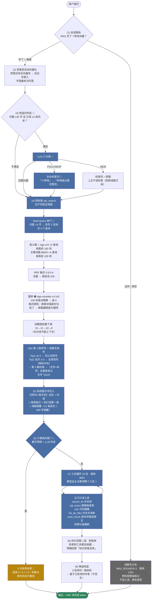
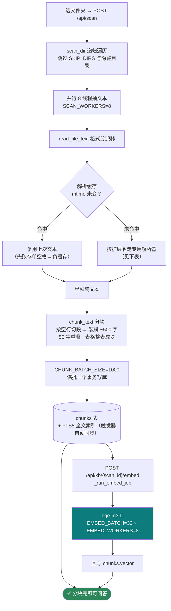
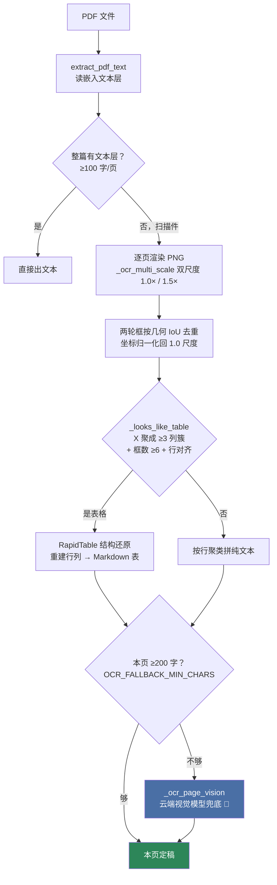
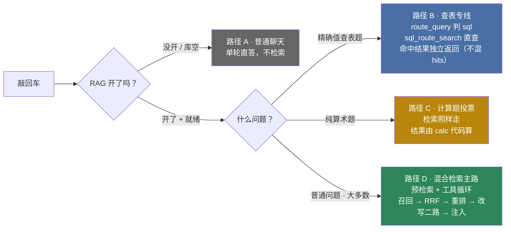

# 检索流程图

> 格式：**Mermaid**（Markdown 内嵌流程图语法）
> 打开方式（任选其一）：
> 1. **VS Code**：装扩展 "Markdown Preview Mermaid Support" → 打开本文件 → Ctrl+Shift+V 预览
> 2. **Typora**：直接打开本文件（原生支持 Mermaid）
> 3. **浏览器**（不用装任何东西）：打开 <https://mermaid.live> → 把下面 mermaid 代码块里的文字复制进去 → 自动出图
> 4. **GitHub / GitLab**：上传后网页自动渲染
>
> **节点颜色 = 调什么模型**（三路模型都填你自己的 URL 和 key，密钥不经过第三方）：
>
> | 标记 | 是什么 | 干什么 |
> |---|---|---|
> | 🤖 蓝色 | 聊天大模型（如 deepseek-v4-flash） | 判定 / 改写 / 投票 / 组织回答 |
> | 🔵 青色 | 嵌入向量模型（如 bge-m3） | 把文本转成向量（语义路用） |
> | 🟠 橙色 | 重排模型（如 bge-reranker-v2-m3） | 给候选块逐对打分精排 |
> | ⚙️ 灰色 | 纯本地代码（正则 / 数学 / SQLite） | 零 API、零费用 |
>
> 配套文档：[检索全链路说明](./检索全链路说明.md)｜[优化全过程](./OPTIMIZATION.md)｜[返回 README](../README.md)

---

## 一、总图：一问到底（服务端 Agent 主链）



> 这张图对应的是 2026-09-24 起的**服务端 Agent 执行器**主路（SSE `/api/agent/chat`）。
> 2026-09-20 那版「前端两次检索 + RRF Top30 + 前端工具循环」保留为对照档，设置弹窗可切。

---

## 二、入库解析全链路（文档 → 可检索的块）



| 扩展名 | 解析器 | 说明 |
|---|---|---|
| `.pdf` | `extract_pdf_text` | 抽不出文本层 → 转下面的 OCR 三阶 |
| `.docx` | `extract_docx_text` | 段落 + 表格 + 补抽 5 类矢量文字（见 2.2） |
| `.doc` | `extract_doc_text` | 先转 `.docx` 再走同管线 |
| `.xlsx` | `extract_xlsx_text` | 每张 Sheet 转 Markdown 表格 |
| `.xls` | `extract_xls_text` | 老格式，依赖 COM / 转换兜底 |
| `.csv` | `extract_csv_text` | 直接读，转 Markdown 表格 |
| `.pptx` | `extract_pptx_text` | 形状文字 + SmartArt 递归抽取 |
| `.ppt` | `extract_ppt_text` | 老格式，同 `.xls` 的预转换路线 |
| 其他（`.txt`/`.md`） | 编码回退链 | `utf-8` → `gb18030` → `gbk`，三种全败才算失败 |

### 2.1 PDF 的三阶兜底（图 2 展开）



「三阶」= ① 文本层 → ② 本地 OCR（RapidOCR + RapidTable）→ ③ 云端视觉模型。
第 ③ 阶只在**本地 OCR 零结果、且聊天 key 可用**时才调；云端也失败就放弃这一页。

### 2.2 `.docx` 补抽的 5 类矢量文字

`python-docx` 的默认 API 只读顶层段落和表格，所以另外补抽这些载体：

| # | 载体 | 抽取方式 |
|---|---|---|
| ① | 文本框 / 形状 | 遍历 `w:txbxContent` 下的 `w:t`，按内容去重 |
| ② | SmartArt | 直读 `word/diagrams/data*.xml`，正则抽 `<a:t>` |
| ③ | 图表 | 抽 `c:pt` / `c:v` 数值 + `a:t` 文本 |
| ④ | OLE 嵌入的 Excel / Word | 落临时文件后递归解析 |
| ⑤ | 图片 Alt Text | 抽 `wp:docPr` 的 `descr` |

每个补抽各自独立 `try`——zip 部件损坏时只丢那一小块，不会把已抽好的段落和表格整篇丢掉。

> B1 / B2 / B4 / B5 四个已修缺陷（OCR 漏 `return`、EMF 图毁整篇、docx 漏读、云端兜底被挡死）
> 的详细行为见 [检索全链路说明 · 1.4 / 1.5](./检索全链路说明.md)。

---

## 三、简图：四条路径



> 查表专线**不是替代**混合检索——`api_search` 里向量路照跑，SQL 命中单独放在 `sql_hits` 字段返回
> （SQL 的 seq 是 `sql:sheet` 字符串，混进整数 seq 的向量块会破坏 `[N]` 引用溯源）。
> 而且它**有条件启用**：只有聊天 key 非空时才判路由。

---

## 四、块数速记卡（主路的数字变化）


> 起点按 **Multi-Query 开启**算（默认开启）：`4 个查询 × 2 通道`。
> 关掉多查询后退化成 `1 个查询 × 2 通道`，RRF 权重也从均权变回 `0.6 : 0.4`。
> 另：重排池固定 100，末段 Top-K 随对话轮数递减（15 → 12 → 10 → 8）。

---

## 五、Agent 工具循环的两种执行位置

> 检索引擎（MQ 改写 → 多路召回 → RRF 融合 → 重排 → Top15）两条链共用**同一个** `api_search()`。
> 唯一的区别是【谁来跑工具循环】。

```text
                    用户提问
                       │
              ┌────────┴────────┐
              │  分流（前端 callChat）│
              └───┬─────────┬───┘
                  │         │
        纯文本 RAG 问      投票 / 追问 / 附件
                  │         │
                  ▼         ▼
         ┌─── SSE 链 ───┐  旧链（前端循环）
         │ POST /api/   │  app.js callChatWithTools
         │ agent/chat   │  · 浏览器跑工具循环
         │  一次连接     │  · 模型调 search_kb →
         └──────┬──────┘    前端执行器 → GET /search
                │              → 格式化 → 回模型
                ▼
       ┌── server 端 ──┐
       │ api_agent_chat│
       │  · 预检索     │ ← 同一个 api_search()
       │  · LLM 流式   │   （MQ / 多路 / RRF / 重排）
       │  · 工具循环   │
       │    agent_tools│ ← 工具执行器也调
       │    五工具      │   同一个 api_search()
       │  · 逐 token 推 │
       └──────────────┘
```

| | 前端循环（旧链） | 服务端循环（SSE，现役主路） |
|---|---|---|
| 工具循环宿主 | 浏览器 JS | server Python |
| 检索入口 | `GET /api/kb/{scan}/search` | `api_search()`（同一函数） |
| LLM 调用 | 前端直调（key 过浏览器） | server 调（key 不过浏览器） |
| 会话持久化 | ✗ 刷新就丢 | ✓ 落 SQLite |
| 评测器 | 需复刻前端逻辑 | 直调 `POST /api/agent/chat` |
| 上下文管理 | 浏览器内存（长对话会爆） | server 端滑窗摘要 + 分级截断 |
| 分流条件 | 投票 / 追问 / 附件走此路 | 纯文本 RAG 走此路 |
| 回退 | — | SSE 失败自动回退前端循环（双保险） |
